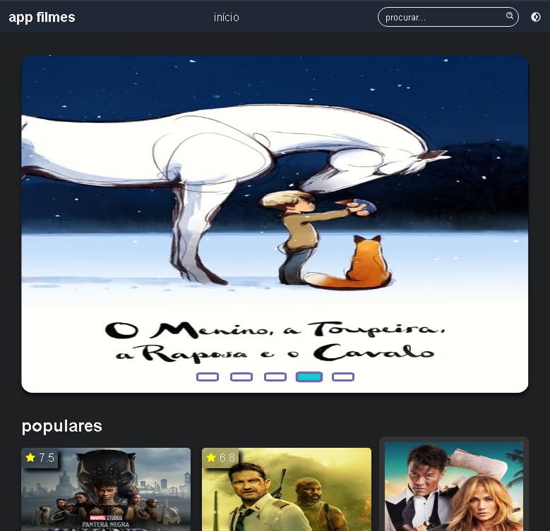
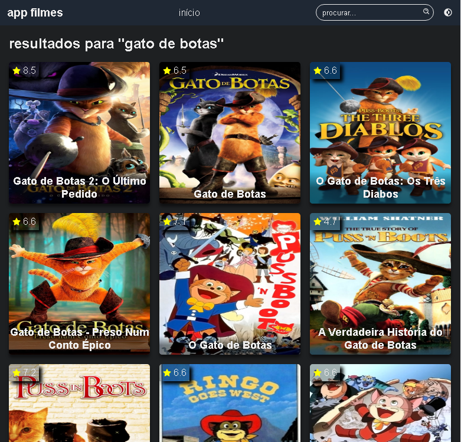
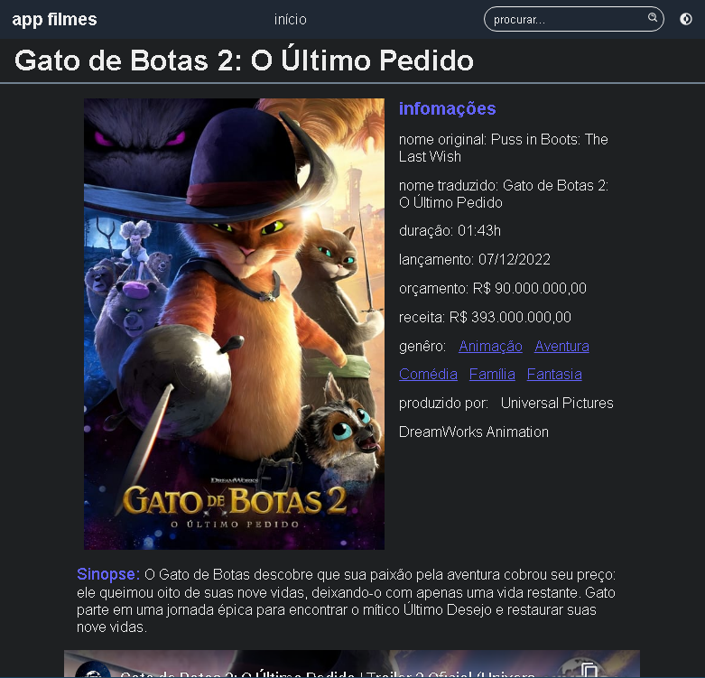

# app filmes

Projeto feito para estudos consumindo a API do <a href="https://www.themoviedb.org/">themoviedb</a>, baseado no video de <a href="https://www.youtube.com/watch?v=XqxUHVVO7-U">Matheus Battisti</a>.

Este é um projeto de filmes simples onde você pode encontrar informações de filmes fornecidas pela API.

## tecnologias utilizadas
<div style="display: flex; gap: 2px; flex-wrap: wrap;">
  

  

  
  
  
  
  
</div>

<br/>

<div>
  <h2 style="margin: 1rem 0; text-decoration: underline;">página inicial</h2>
  </img>

  <h2 style="margin: 1rem 0; text-decoration: underline;">página de busca</h2>
  </img>

  <h2 style="margin: 1rem 0; text-decoration: underline;">página do filme</h2>
  </img>
</div>

## instalação das bibliotecas
```bash
$ npm install
# ou
$ npm i
```

## start local da aplicação
```bash
$ npm run dev
```